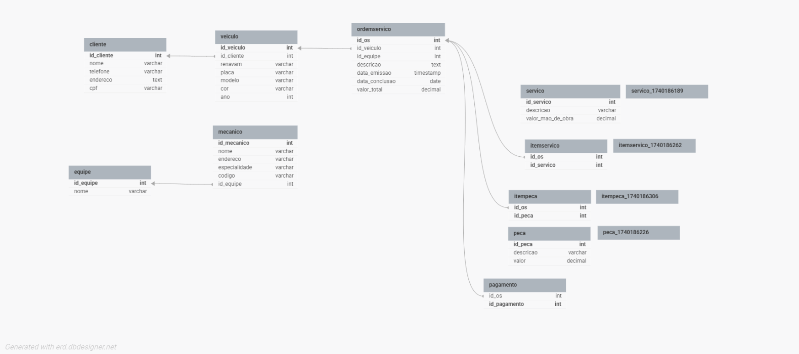

# 📌 **Projeto: Banco de Dados para Oficina Mecânica**  

## 📌 **Descrição**  
Este repositório contém a modelagem conceitual e lógica do banco de dados para um **sistema de controle e gerenciamento de ordens de serviço em uma oficina mecânica**. O objetivo é criar uma base de dados eficiente para **gestão de clientes, veículos, ordens de serviço, equipe de mecânicos, serviços, peças e pagamentos**.  

A modelagem foi feita utilizando o **DB Designer** e inclui um **passo a passo detalhado** para implementação.  

---

## 👉 **Entidades Principais e Relacionamentos**  

### **1️⃣ Cliente**  
- Clientes levam veículos para consertos ou revisões periódicas.  
- Possui identificação única, nome, CPF e endereço.  
- Pode possuir múltiplos veículos cadastrados.  

### **2️⃣ Veículo**  
- Cada veículo pertence a um único cliente.  
- Possui identificação única (**Renavam** e **Placa**), modelo, cor e ano.  
- Pode ter múltiplas ordens de serviço ao longo do tempo.  

### **3️⃣ Ordem de Serviço (OS)**  
- Criada quando um veículo entra na oficina.  
- Inclui informações como número, data de emissão, status, data prevista para conclusão e valor total.  
- Relacionada a um veículo e um cliente.  
- Associada a uma equipe de mecânicos.  
- Pode ter múltiplos serviços e peças vinculadas.  

### **4️⃣ Equipe de Mecânicos**  
- Cada OS é designada a uma equipe de mecânicos.  
- Os mecânicos possuem código, nome, endereço e especialidade.  
- Uma equipe pode estar associada a várias OS.  

### **5️⃣ Serviço**  
- Cada OS possui múltiplos serviços prestados.  
- Cada serviço tem um valor definido com base em uma tabela de referência de mão de obra.  

### **6️⃣ Peça**  
- Cada OS pode incluir peças substituídas.  
- Cada peça possui um código, descrição e valor unitário.  

### **7️⃣ Pagamento**  
- Cada OS possui um pagamento vinculado.  
- Pode ser realizado via **dinheiro, cartão, boleto ou Pix**.  

---

## 🛠 **Modelagem Conceitual**  

A modelagem foi criada no **DB Designer** e segue o modelo **Entidade-Relacionamento (ER)**.  
📌 **Acesse o diagrama no DB Designer:** [🔗 Link do Projeto ([DB DESIGNER](https://dbdesigner.page.link/37Jdz4gbSu4E3wPDA))]  

<p align="center">
  
</p>   

📌 **Principais Relacionamentos:**  
- Um **cliente** pode ter **vários veículos**, mas um **veículo pertence a um único cliente**.  
- Uma **ordem de serviço** está associada a **um veículo e um cliente**.  
- Uma **ordem de serviço** pode conter **vários serviços e peças**.  
- Um **mecânico pode estar associado a várias ordens de serviço**.  
- Um **pagamento** está vinculado a **uma única OS**.  

---

## 🚀 **Passo a Passo para Criar o Banco de Dados**  

### 🏰 **1️⃣ Criando as Tabelas**  

📌 **Clientes**  
```sql
CREATE TABLE Cliente (
    id_cliente INT PRIMARY KEY AUTO_INCREMENT,
    nome VARCHAR(100) NOT NULL,
    telefone VARCHAR(15),
    endereco TEXT NOT NULL,
    cpf VARCHAR(11) UNIQUE NOT NULL
);
```  

📌 **Veículos**  
```sql
CREATE TABLE Veiculo (
    id_veiculo INT PRIMARY KEY AUTO_INCREMENT,
    id_cliente INT,
    renavam VARCHAR(45) UNIQUE NOT NULL,
    placa VARCHAR(10) UNIQUE NOT NULL,
    modelo VARCHAR(50) NOT NULL,
    cor VARCHAR(30),
    ano INT NOT NULL,
    FOREIGN KEY (id_cliente) REFERENCES Cliente(id_cliente)
);
```  

📌 **Equipes de Mecânicos**  
```sql
CREATE TABLE Equipe (
    id_equipe INT PRIMARY KEY AUTO_INCREMENT,
    nome VARCHAR(100) NOT NULL
);
```  

📌 **Mecânicos**  
```sql
CREATE TABLE Mecanico (
    id_mecanico INT PRIMARY KEY AUTO_INCREMENT,
    nome VARCHAR(100) NOT NULL,
    endereco VARCHAR(255),
    especialidade VARCHAR(100) NOT NULL,
    codigo VARCHAR(45) UNIQUE NOT NULL,
    id_equipe INT,
    FOREIGN KEY (id_equipe) REFERENCES Equipe(id_equipe)
);
```  

📌 **Ordens de Serviço**  
```sql
CREATE TABLE OrdemServico (
    id_os INT PRIMARY KEY AUTO_INCREMENT,
    id_veiculo INT,
    id_equipe INT,
    descricao TEXT NOT NULL,
    data_emissao TIMESTAMP DEFAULT CURRENT_TIMESTAMP,
    status ENUM('Aberta', 'Em andamento', 'Concluída', 'Cancelada') DEFAULT 'Aberta',
    data_conclusao DATE,
    valor_total DECIMAL(10,2) NOT NULL,
    FOREIGN KEY (id_veiculo) REFERENCES Veiculo(id_veiculo),
    FOREIGN KEY (id_equipe) REFERENCES Equipe(id_equipe)
);
```  

📌 **Serviços**  
```sql
CREATE TABLE Servico (
    id_servico INT PRIMARY KEY AUTO_INCREMENT,
    descricao VARCHAR(100) NOT NULL,
    valor_mao_de_obra DECIMAL(10,2) NOT NULL
);
```  

📌 **Peças**  
```sql
CREATE TABLE Peca (
    id_peca INT PRIMARY KEY AUTO_INCREMENT,
    descricao VARCHAR(100) NOT NULL,
    valor DECIMAL(10,2) NOT NULL
);
```  

📌 **Relacionamento entre OS e Serviços**  
```sql
CREATE TABLE ItemServico (
    id_os INT,
    id_servico INT,
    PRIMARY KEY (id_os, id_servico),
    FOREIGN KEY (id_os) REFERENCES OrdemServico(id_os),
    FOREIGN KEY (id_servico) REFERENCES Servico(id_servico)
);
```  

📌 **Relacionamento entre OS e Peças**  
```sql
CREATE TABLE ItemPeca (
    id_os INT,
    id_peca INT,
    PRIMARY KEY (id_os, id_peca),
    FOREIGN KEY (id_os) REFERENCES OrdemServico(id_os),
    FOREIGN KEY (id_peca) REFERENCES Peca(id_peca)
);
```  

📌 **Pagamentos**  
```sql
CREATE TABLE Pagamento (
    id_pagamento INT PRIMARY KEY AUTO_INCREMENT,
    id_os INT UNIQUE,
    forma_pagamento ENUM('Dinheiro', 'Cartão', 'PIX', 'Boleto') NOT NULL,
    FOREIGN KEY (id_os) REFERENCES OrdemServico(id_os)
);
```  

---

## 🏆 **Resumo da Estrutura**  

| Entidade | Atributos Principais | Relacionamentos |
|----------|----------------------|----------------|
| **Cliente** | id_cliente, nome, cpf, endereço | 1 cliente → N veículos |
| **Veículo** | id_veiculo, renavam, placa, modelo, cor, ano | 1 veículo → N ordens de serviço |
| **Ordem de Serviço** | id_os, descricao, data_emissao, status, valor_total | 1 OS → N serviços e peças |
| **Equipe** | id_equipe, nome | 1 equipe → N ordens de serviço |
| **Mecânico** | id_mecanico, nome, especialidade, código | 1 mecânico → pertence a 1 equipe |
| **Serviço** | id_servico, descricao, valor_mao_de_obra | N OS → N serviços |
| **Peça** | id_peca, descricao, valor | N OS → N peças |
| **Pagamento** | id_pagamento, forma_pagamento | 1 OS → 1 pagamento |

---

## 📅 **Próximos Passos**  
✅ Criar o banco de dados no MySQL/PostgreSQL  
✅ Implementar API para interação com o banco  
✅ Criar interface para gerenciamento  

🚀 **Vamos construir juntos!**# Oficina-mecanica-jj
